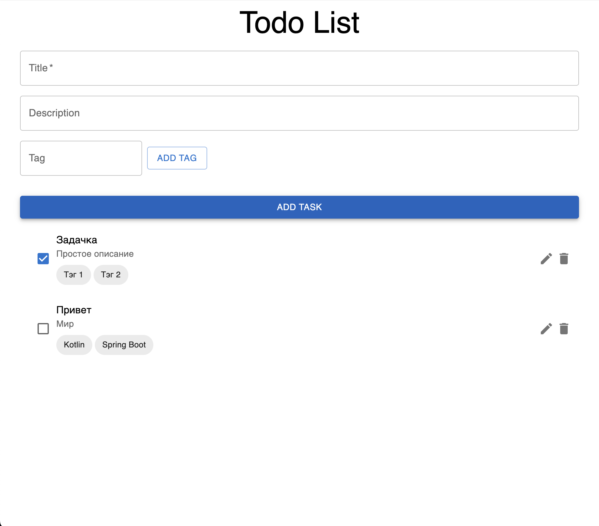
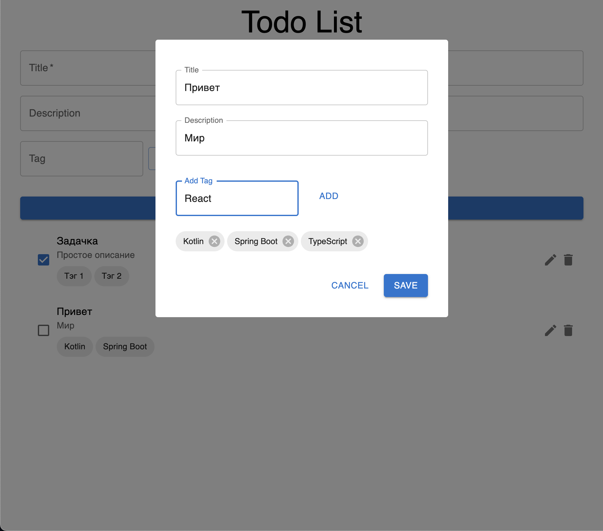

# Todo Application

## Описание
Это простая реализация Todo приложения для практики в Kotlin и TypeScript



## Запуск
### Backend
```shell
cd todo-api
./gradlew generateJooqClasses
./gradlew bootJar
java -jar build/libs/todo-api-0.0.1-SNAPSHOT.jar
```

### Frontend
```shell
cd todo-ui
npm install
npm run generate
npm run dev
```

## Технологии
### Backend
- Kotlin
- Spring Book
- JOOQ
- Flyway
- PostgreSQL
- MapStruct

## Статус
Проект _не окончен_

## Цель
Ознакомиться с возможностями языков и лучшими практиками

## Контакты
Выполнен [Гурьяновым Марком](https://mark1708.github.io/)
#### +7(962)024-50-04 | mark1708.work@gmail.com | [github](http://github.com/Mark1708)

